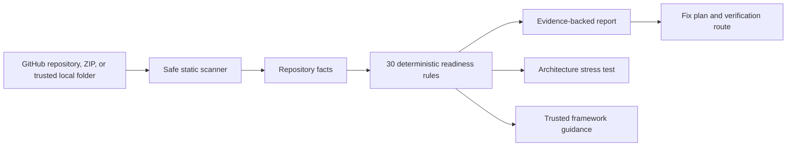
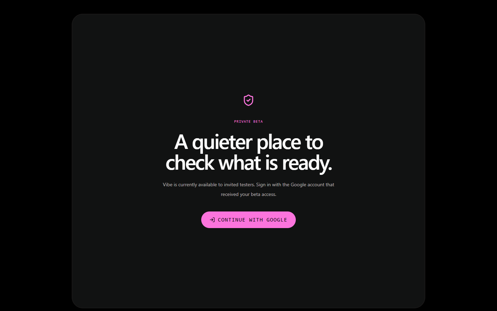

# Vibe

> Evidence-first launch-readiness audits for AI-built web apps.

[](https://github.com/Abhinav-0311/Vibe/actions/workflows/quality.yml)
[Live private beta](https://vibe-seven-snowy.vercel.app) · [Case study](./docs/PORTFOLIO_CASE_STUDY.md) · [Deployment guide](./docs/DEPLOYMENT.md)

Vibe inspects a Node.js project without executing its code, identifies the production systems a builder may have missed, and turns those findings into grounded explanations, verification routes, and scoped implementation prompts.


## The problem

An app working locally does not prove it is ready for users. Authentication recovery, webhook validation, environment hygiene, tests, deployment safety, observability, and rate limits are easy to miss when shipping quickly.

Vibe gives builders one defensible answer: **what is missing, why it matters, which repository evidence triggered it, and how to verify the fix.**

## How it works



The deterministic scanner and checklist remain the source of truth. Optional OpenAI enhancement can produce a structured FixPlan, but it cannot change the score, severity, category, finding ID, or scanner evidence. Invalid output falls back to the deterministic report.

## Inside a scan

| Score breakdown | Evidence and findings |
| --- | --- |
|  |  |

## Hosted private beta



## What Vibe covers

- Safe GitHub, ZIP, and trusted local-project scanning; scanned repository code is never executed.
- Context-aware readiness scoring for prototypes, launch-prep products, SaaS, internal tools, content sites, portfolios, and APIs.
- Static evidence for routes, authentication, payments, webhooks, CORS, rate limiting, environment files, tests, lockfiles, build scripts, analytics, and observability.
- PostgreSQL-backed scan history, deterministic deduplication, report restore, and a dependency-aware health endpoint.
- GitHub OAuth with PKCE, branch selection, and explicit-only issue creation.
- Versioned Next.js and Vite guidance with official sources, verification routes, and owner-scoped feedback.
- Per-finding relevance and usefulness feedback, stored only for the signed-in beta user.
- Optional structured OpenAI FixPlans with strict grounding and deterministic fallback.

## Trust boundaries

- Vibe is a static repository auditor, not a runtime security guarantee.
- It does not run installs, scripts, builds, tests, migrations, or servers from scanned projects.
- ZIP files are size-limited, path-validated, extracted temporarily, and removed after inspection.
- Secret values are not displayed; only safe file and configuration signals are reported.
- GitHub issue creation is explicit-user-action only.

## Engineering proof

| Area | Current evidence |
| --- | --- |
| Readiness engine | 30 deterministic rules across 8 regression contexts |
| Automated checks | 120 Vitest cases across 21 test files |
| Delivery gate | ESLint, Prisma validation, and a Next.js production build |
| Data layer | PostgreSQL + Prisma migrations + scan deduplication |
| Hosted access | Vercel private beta with Google sign-in and invite gating |

These are implementation checks, not a claim of broad external benchmarking. See the [case study](./docs/PORTFOLIO_CASE_STUDY.md) for the evidence model and known limitations.

## Stack

Next.js 16 · React 19 · TypeScript · Tailwind CSS · Prisma 7 · PostgreSQL · NextAuth · GitHub OAuth 2.0 + PKCE · OpenAI Responses API · Vitest · GitHub Actions · Vercel

## Run locally

```powershell
npm.cmd install
docker compose up -d
npm.cmd run db:generate
npm.cmd run db:deploy
npm.cmd run dev -- --port 3005
```

Create `.env` from [`.env.example`](./.env.example) before starting. For configuration, database commands, deployment, and recovery, use the [deployment guide](./docs/DEPLOYMENT.md).

## Verification

```powershell
npm.cmd run lint
npm.cmd test
npm.cmd run build
npx.cmd prisma validate
```

## Repository map

- [`app/`](./app) — product UI and route handlers
- [`lib/scanner/`](./lib/scanner) — safe repository fact collection
- [`lib/checklist/`](./lib/checklist) — deterministic rules and readiness scoring
- [`lib/report/`](./lib/report) — report generation and bounded AI enhancement
- [`prisma/`](./prisma) — schema and migrations
- [`tests/`](./tests) — scanner, checklist, API, report, and safety coverage
- [`docs/`](./docs) — architecture, trust, QA, deployment, and roadmap material

## Project status

Vibe is a deployed private beta. The next meaningful work is calibration against more real projects and collecting beta-user feedback—not adding features without evidence of need.

## Further reading

- [Portfolio case study](./docs/PORTFOLIO_CASE_STUDY.md)
- [Trust and safety](./docs/TRUST_AND_SAFETY.md)
- [MVP QA report](./docs/MVP_QA_REPORT.md)
- [Future roadmap](./docs/FUTURE_ROADMAP.md)
- [Limitations](./docs/LIMITATIONS.md)
