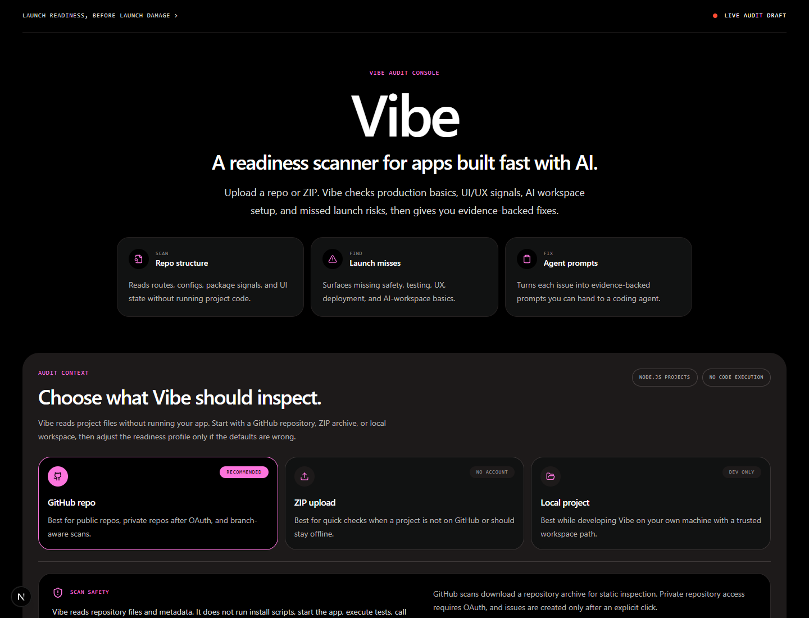
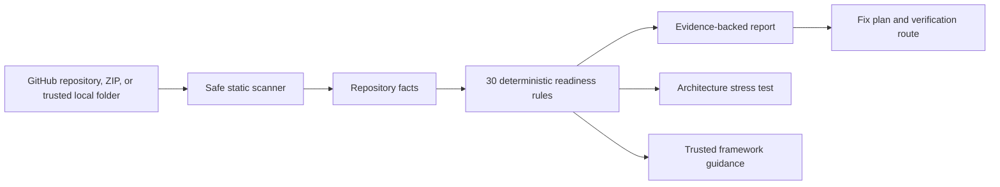
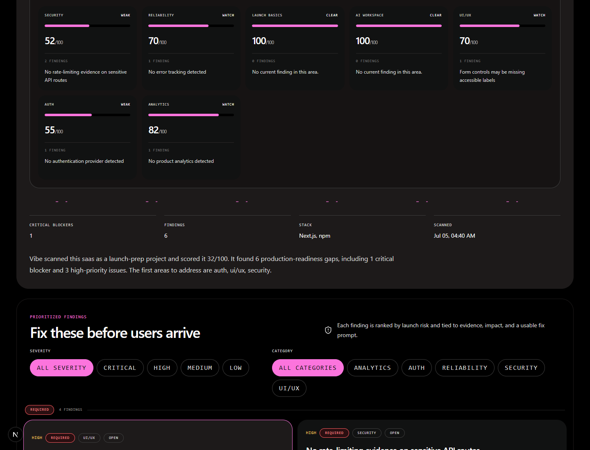
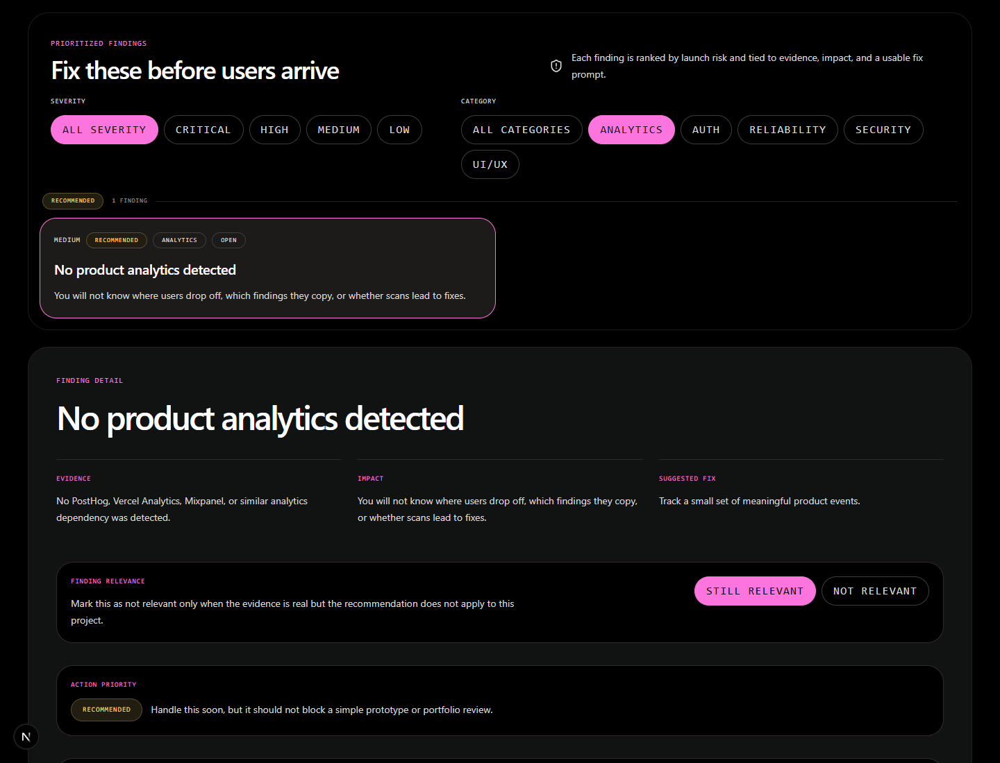

# Vibe

> Evidence-first launch-readiness audits for AI-built web apps.

[](https://github.com/Abhinav-0311/Vibe/actions/workflows/quality.yml)
[Live app](https://vibe-seven-snowy.vercel.app) · [Case study](./docs/PORTFOLIO_CASE_STUDY.md) · [Deployment guide](./docs/DEPLOYMENT.md)

Vibe inspects a Node.js project without executing its code, identifies the production systems a builder may have missed, and turns those findings into grounded explanations, verification routes, and scoped implementation prompts.



## The problem

An app working locally does not prove it is ready for users. Authentication recovery, webhook validation, environment hygiene, tests, deployment safety, observability, and rate limits are easy to miss when shipping quickly.

Vibe gives builders one defensible answer: **what is missing, why it matters, which repository evidence triggered it, and how to verify the fix.**

## How it works


```mermaid
flowchart LR
  A[GitHub repository, ZIP, or trusted local folder] --> B[Safe static scanner]
  B --> C[Repository facts]
  C --> D[30 deterministic readiness rules]
  D --> E[Evidence-backed report]
  E --> F[Fix plan and verification route]
  D --> G[Architecture stress test]
  D --> H[Trusted framework guidance]
```

The deterministic scanner and checklist remain the source of truth. Optional OpenAI enhancement can produce a structured FixPlan, but it cannot change the score, severity, category, finding ID, or scanner evidence. Invalid output falls back to the deterministic report.

## Inside a scan

| Score breakdown | Evidence and findings |
| --- | --- |
|  |  |

## Getting started

Open the [live app](https://vibe-seven-snowy.vercel.app) and continue with Google. No invitation or manual approval is required. Scan a public GitHub repository or upload a ZIP; saved reports belong only to your account.

## What Vibe covers

- Safe GitHub, ZIP, and trusted local-project scanning; scanned repository code is never executed.
- Context-aware readiness scoring for prototypes, launch-prep products, SaaS, internal tools, content sites, portfolios, and APIs.
- Static evidence for routes, authentication, payments, webhooks, CORS, rate limiting, environment files, tests, lockfiles, build scripts, analytics, and observability.
- PostgreSQL-backed scan history, deterministic deduplication, report restore, and a dependency-aware health endpoint.
- GitHub OAuth with PKCE, branch selection, and explicit-only issue creation.
- Versioned Next.js and Vite guidance with official sources, verification routes, and owner-scoped feedback.
- Per-finding relevance and usefulness feedback, stored only for the signed-in user, with visible scan allowances and self-service account-data deletion.
- Optional structured OpenAI FixPlans with strict grounding and deterministic fallback.

## Trust boundaries

- Vibe is a static repository auditor, not a runtime security guarantee.
- It does not run installs, scripts, builds, tests, migrations, or servers from scanned projects.
- ZIP files are size-limited, path-validated, extracted temporarily, and removed after inspection.
- Secret values are not displayed; only safe file and configuration signals are reported.
- GitHub issue creation is explicit-user-action only.

## Engineering proof

| Area | Current evidence |
| --- | --- |
| Readiness engine | 30 deterministic rules across 12 representative project shapes |
| Automated checks | Authentication regressions plus real PostgreSQL/HTTP acceptance; see the dated [QA report](./docs/MVP_QA_REPORT.md) for the latest executed count |
| Delivery gate | ESLint, TypeScript, Prisma schema validation, and a Next.js production build |
| Local concurrency | Static ZIP fixtures at 1/5/10/20 jobs; real HTTP burst of 20 uploads: four accepted, 16 rate-limited; not hosted capacity |
| Data layer | PostgreSQL + Prisma migrations + scan deduplication |
| Access | Google sign-in open to verified Google accounts; owner-scoped scans and daily quotas |
| Hosted acceptance | Fresh Google sign-in/out, public GitHub scan, evidence, copy/export, restore, mobile/keyboard smoke checks; ZIP fix/re-scan: 76 → 83 (2026-10-08/09) |

Automated and concurrency measurements are local implementation checks, not broad external benchmarking or production load testing. The static concurrency harness mocks persistence; the separate HTTP suite uses a disposable local PostgreSQL database and real database sessions to verify ownership, deletion, quotas, and rate limits. Neither calls an AI provider. See the [QA report](./docs/MVP_QA_REPORT.md) for measurements and remaining checks, and the [case study](./docs/PORTFOLIO_CASE_STUDY.md) for the evidence model and known limitations.

## Stack

Next.js 16 · React 19 · TypeScript · Tailwind CSS · Prisma 7 · PostgreSQL · NextAuth · GitHub OAuth 2.0 + PKCE · OpenAI Responses API · Vitest · GitHub Actions · Vercel

## Run locally

```powershell
npm.cmd install
docker compose up -d
npm.cmd run db:generate
npm.cmd run db:deploy
npm.cmd run dev -- --port 3005
```

Create `.env` from [`.env.example`](./.env.example) before starting. For configuration, database commands, deployment, and recovery, use the [deployment guide](./docs/DEPLOYMENT.md).

## Verification

```powershell
npm.cmd run lint
npm.cmd run build
npm.cmd test
npx.cmd --no-install tsc --noEmit
npx.cmd --no-install prisma validate
```

CI provisions PostgreSQL and runs the full suite. Without `VIBE_TEST_DATABASE_URL`, local runs skip the three HTTP/database cases. To run those, first migrate a **disposable loopback database named `vibe_closeout_test`**, build the app, then set `VIBE_TEST_DATABASE_URL` to that database's connection string and run `npm.cmd test`. Never point this suite at production or a shared database.

## Repository map

- [`app/`](./app) — product UI and route handlers
- [`lib/scanner/`](./lib/scanner) — safe repository fact collection
- [`lib/checklist/`](./lib/checklist) — deterministic rules and readiness scoring
- [`lib/report/`](./lib/report) — report generation and bounded AI enhancement
- [`prisma/`](./prisma) — schema and migrations
- [`tests/`](./tests) — scanner, checklist, API, report, and safety coverage
- [`docs/`](./docs) — architecture, trust, QA, deployment, and roadmap material

## Project status

Vibe is a deployed readiness auditor. Google sign-in replaces invitation-based enrollment; authentication, ownership checks, quotas, retention, and deletion remain enforced. The [account guide](./docs/ACCOUNTS.md) covers setup and verification, including Google's own OAuth audience settings. Hosted checks on 2026-10-08/09 covered Google sign-in/out, public GitHub scanning, evidence, copy/export, saved-scan restore, responsive/keyboard use, and a comparable ZIP fix/re-scan. Private GitHub flows, live AI enhancement, hosted capacity, and a full accessibility/performance audit remain unverified. Error-alert setup was explicitly skipped by the owner; runtime logs remain available, but notification delivery is not configured. Open registration is not a claim of unlimited capacity. See the [QA report](./docs/MVP_QA_REPORT.md) for exact boundaries. The next product work is collecting user feedback, not adding features without evidence of need.

## Further reading

- [Portfolio case study](./docs/PORTFOLIO_CASE_STUDY.md)
- [Trust and safety](./docs/TRUST_AND_SAFETY.md)
- [MVP QA report](./docs/MVP_QA_REPORT.md)
- [Future roadmap](./docs/FUTURE_ROADMAP.md)
- [Limitations](./docs/LIMITATIONS.md)
