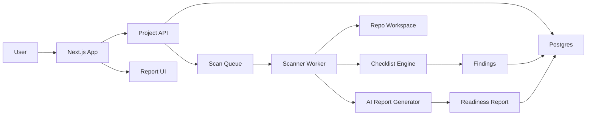

# Technical Architecture

## Recommended MVP Stack

Frontend and app shell:

- Next.js
- TypeScript
- Tailwind CSS
- shadcn/ui
- Lucide icons
- TanStack Query

Backend:

- Next.js route handlers for MVP
- PostgreSQL
- Prisma or Drizzle
- Background job queue
- Redis for scan jobs

Auth:

- Clerk for fastest SaaS onboarding
- Supabase Auth if the project should stay closer to Supabase-native patterns

Storage:

- Local filesystem during development
- Object storage later for uploaded repo archives and report artifacts

AI:

- OpenAI API for report generation and prompt generation
- Deterministic scanner output should be the source of truth

Code analysis:

- File-system scanner
- Package manifest parser
- Next.js route detector
- Environment variable detector
- Stripe/auth/library detector
- Tree-sitter later for deeper parsing
- Semgrep later for stronger security rules
- AI workspace context detector

Infrastructure:

- Vercel for app hosting
- Supabase Postgres or managed Postgres
- Upstash Redis or managed Redis
- Sentry for error tracking
- PostHog for product analytics
- Resend for transactional emails

## System Components

## Data Model

Current MVP table:

- `ScanRecord`: stores the full scan response as JSON plus indexed fields for score, app type, stage, finding count, and scan time.

Future tables:

- users
- organizations
- projects
- scans
- scan_findings
- checklist_items
- generated_prompts
- scan_artifacts
- feedback
- ai_workspace_findings

Later tables:

- repositories
- github_installations
- github_issues
- subscriptions
- usage_events

## Finding Shape

Each finding should store:

- id
- project_id
- scan_id
- category
- severity
- title
- description
- evidence
- recommended_fix
- generated_prompt
- confidence
- status
- created_at

## Scanner Pipeline

1. Receive project source.
2. Normalize workspace into a temporary scan directory.
3. Detect package manager and framework.
4. Parse package manifests and lockfiles.
5. Detect routes, middleware, API handlers, auth/payment files, env usage, test files, and config files.
6. Detect AI workspace context files, rules files, memory docs, and setup checklists.
7. Run checklist rules.
8. Generate findings.
9. Pass structured scanner facts to the AI report layer.
10. Save report and findings.
11. Render report in the dashboard.

## MVP Rule Examples

Auth:

- No auth provider dependency detected.
- Auth dependency exists but no password reset route or provider configuration signal found.
- No email verification signal detected.

Security:

- No middleware file detected for request-level protection.
- No rate limiting dependency or custom rate limiter found.
- Environment variables used but no `.env.example` found.
- Stripe webhook route found but no signature verification signal found.

Payments:

- Stripe dependency detected but no webhook route found.
- Subscription terms appear in code but no entitlement guard signal found.

Reliability:

- No error monitoring dependency detected.
- No structured logging dependency detected.
- No tests detected.

Launch basics:

- No privacy policy route detected.
- No terms route detected.
- No pricing page detected for paid apps.

AI workspace readiness:

- No durable project rules file detected.
- No memory or decision log detected.
- No AI boundary instructions detected.
- No setup checklist for MCP/API integrations detected.
- No session-start workflow detected.

## Security Boundaries

MVP should never execute arbitrary project code.

Allowed:

- Read files
- Parse manifests
- Parse source text
- Run safe static checks

Avoid in MVP:

- Installing dependencies from user repos
- Running user scripts
- Executing tests from untrusted projects
- Running arbitrary shell commands from scanned repos
- Requesting or storing third-party API credentials for Gmail, calendar, stores, socials, or similar business systems

## Implementation Strategy

Start with local upload/path scanning before GitHub integration.

Reason:

- Faster development
- Less OAuth complexity
- Easier scanner iteration
- Avoids premature GitHub App setup

Add GitHub integration only after the local scanner produces useful reports.
