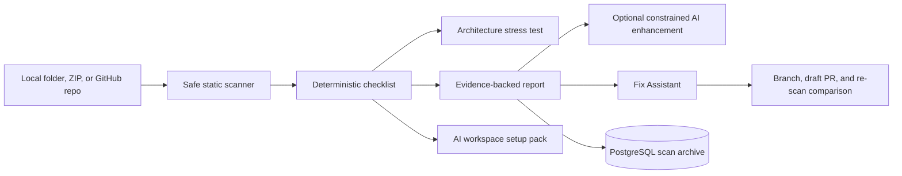

# Vibe: AI-Built App Launch Readiness

## Problem

AI coding tools help new builders produce working interfaces quickly, but a local demo does not prove authentication safety, payment integrity, deployment repeatability, observability, or durable AI project context.

## Product

Vibe scans a local Next.js project, uploaded ZIP archive, or GitHub repository without executing project code. It converts repository facts into context-aware findings, a readiness report, an architecture stress test, an AI workspace setup pack, and a verified fix workflow.

## AI Engineering Decisions

- Deterministic scanner and checklist rules remain the source of truth.
- Optional OpenAI output is schema-constrained and may improve only narrative and prompts.
- Model output cannot add findings, remove evidence, change severity, or alter the score.
- Every model failure falls back to the deterministic report.
- Generated AI workspace files mark unknown product facts as TODOs instead of inventing them.

## System Flow

## Safety Boundaries

- Scanned project code is never executed.
- Uploaded archives are size-limited, path-validated, extracted temporarily, and deleted.
- Local paths are restricted to the configured workspace root.
- OAuth tokens are encrypted before cookie storage.
- GitHub branches, issues, and draft pull requests require explicit user actions.
- Vibe never edits repository code or claims a finding is fixed without a comparable re-scan.

## Technical Stack

- Next.js 15 App Router, React 19, TypeScript, Tailwind CSS
- Next.js Route Handlers and Node.js static filesystem inspection
- PostgreSQL 17, Prisma 7, and Prisma PostgreSQL adapter
- GitHub OAuth 2.0 with PKCE and GitHub REST API
- Optional OpenAI structured output with deterministic fallback
- Vitest and GitHub Actions quality gates

## Demonstration Story

1. Scan a repository using launch-prep context.
2. Open a finding and inspect its exact evidence.
3. Export the implementation plan or AI workspace setup pack.
4. Create a fix branch, implement changes, and open a draft pull request.
5. Re-scan the branch and show resolved, remaining, and introduced findings.

For a timed walkthrough, use [DEMO_SCRIPT.md](./DEMO_SCRIPT.md).

## Engineering Value Demonstrated

- Designing an AI feature around deterministic evidence rather than unrestricted generation
- Building secure repository ingestion and GitHub OAuth workflows
- Translating static code signals into contextual product risk
- Designing model fallbacks, trust boundaries, persistence, and measurable verification
- Delivering a full-stack product with tests, CI, deployment, and recovery documentation
