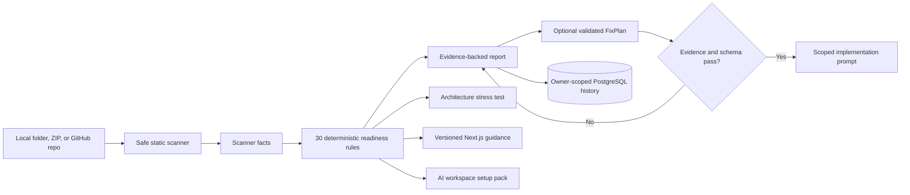

# Vibe: Evidence-First Launch Readiness for AI-Built Apps

## Problem

AI coding tools help new builders produce working interfaces quickly, but a local demo does not prove authentication safety, payment integrity, deployment repeatability, observability, or durable AI project context.

## Product

Vibe scans a local Node.js project, uploaded ZIP archive, or GitHub repository without executing project code. It converts repository facts into context-aware findings, a readiness report, an architecture stress test, trusted Next.js guidance, and an AI workspace setup pack.

## AI Engineering Decisions

- Deterministic scanner and checklist rules remain the source of truth.
- Optional OpenAI output is schema-constrained into one FixPlan per finding.
- Model output cannot add findings, remove evidence, change severity, alter the score, or rewrite the deterministic report.
- Each FixPlan must copy the scanner evidence and verification route exactly; failed validation falls back to deterministic output.
- The API request uses `store: false`; token metadata, processing time, and optional owner-configured cost estimates are recorded with the scan payload.
- Generated AI workspace files mark unknown product facts as TODOs instead of inventing them.

## System Flow

```mermaid
flowchart LR
    A[Local folder, ZIP, or GitHub repo] --> B[Safe static scanner]
    B --> C[Scanner facts]
    C --> D[30 deterministic readiness rules]
    D --> E[Evidence-backed report]
    D --> F[Architecture stress test]
    D --> G[Versioned Next.js guidance]
    E --> H[Optional validated FixPlan]
    H --> I{Evidence and schema pass?}
    I -->|Yes| J[Scoped implementation prompt]
    I -->|No| E
    D --> K[AI workspace setup pack]
    E --> L[(Owner-scoped PostgreSQL history)]
```

## Safety Boundaries

- Scanned project code is never executed.
- Uploaded archives are size-limited, path-validated, extracted temporarily, and deleted.
- Local paths are restricted to the configured workspace root.
- OAuth tokens are encrypted before cookie storage.
- GitHub issue creation requires explicit user action.
- Vibe never edits repository code or claims production readiness beyond static evidence.

## Technical Stack

- Next.js 16 App Router, React 19, TypeScript, Tailwind CSS
- Next.js Route Handlers and Node.js static filesystem inspection
- PostgreSQL 17, Prisma 7, and Prisma PostgreSQL adapter
- GitHub OAuth 2.0 with PKCE and GitHub REST API
- Optional OpenAI structured output with deterministic fallback
- Vitest and GitHub Actions quality gates

## Demonstration Story

1. Scan a repository using launch-prep context.
2. Open a finding and inspect the exact scanner evidence.
3. Show the deterministic readiness report and the optional validated FixPlan metadata when AI enhancement is enabled.
4. Open a trusted Next.js guidance item: explain why it appeared, its verification route, and its official source.
5. Re-scan after one targeted change to show comparable improvement, then show saved scan history.

## Engineering Value Demonstrated

- Designing an AI feature around deterministic evidence rather than unrestricted generation
- Building secure repository ingestion and GitHub OAuth workflows
- Translating static code signals into contextual product risk
- Designing model fallbacks, strict output validation, per-scan timing, feedback capture, and measurable verification
- Delivering a full-stack product with tests, CI, deployment, and recovery documentation

## Verified Engineering Snapshot

Current local validation on 2026-09-02:

- 30 distinct readiness rules
- 8 regression contexts covering content sites, SaaS account flows, payment webhooks, and APIs
- 116 passing Vitest cases across 21 executed test files
- ESLint and the Next.js production build passing

These are implementation checks, not a claim that Vibe has been validated against a large external-repository benchmark. The confirmed live self-scan is Vibe itself; broader real-repository validation remains future work.
